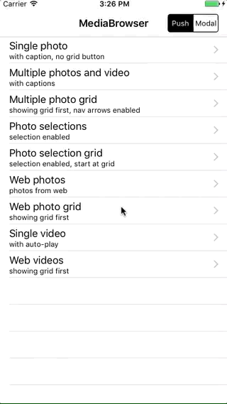
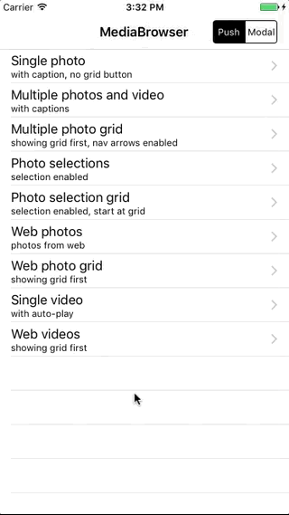

<p align="center">
  
  
  <a href="https://cocoapods.org/pods/MediaBrowser" target="_blank">
    
  </a>
  <a href="https://github.com/younatics/MediaBrowser" target="_blank">
    
  </a>
  <a href="http://cocoadocs.org/docsets/MediaBrowser" target="_blank">
    
  </a>
  <a href="https://github.com/Carthage/Carthage" target="_blank">
    
  </a>
    <a href="(https://github.com/younatics/MediaBrowser/blob/master/LICENSE" target="_blank">
    
  </a>
</p>

## Intoduction
🏞 **MediaBrowser** can display one or more images or videos by providing either `UIImage` objects, `PHAsset` objects, or `URLs` to library assets, web images/videos or local files. MediaBrowser handles the downloading and caching of photos from the web seamlessly. Photos can be zoomed and panned, and optional (customisable) captions can be displayed. This can also be used to allow the user to select one or more photos using either the grid or main image view.

Also, MediaBrowser use latest [SDWebImage](https://github.com/rs/SDWebImage) version for caching, motivated by [MWPhotoBrowser](https://github.com/mwaterfall/MWPhotoBrowser)

| Single Photo | Multiple Photos And Video |
| ------------- | ------------------------ |
|  |  |
| Multiple Photo Grid | Multiple Photo Selection |
|   |   |
| Web Photos | Web Photos Grid |
|   |   |

## Requirements
`MediaBrowser` is written in Swift 3. Compatible with iOS 8.1+

## Usage
### Basic

Get `MediaBrowser` and set `MediaBrowserDelegate`
```Swift 
let browser = MediaBrowser(delegate: self)
self.navigationController?.pushViewController(browser, animated: true)

//MediaBrowserDelegate
func numberOfMedia(in mediaBrowser: MediaBrowser) -> Int {
  return mediaArray.count
}
    
func media(for mediaBrowser: MediaBrowser, at index: Int) -> Media {
  if index < mediaArray.count {
    return mediaArray[index]
  }
  return DemoData.localMediaPhoto(imageName: "MotionBookIcon", caption: "Photo at index is Wrong")
}
```

## Installation
### Cocoapods
```ruby
pod 'MediaBrowser'
```
### Carthage
```
github "younatics/MediaBrowser"
```

## References
#### Please tell me or make pull request if you use this library in your application :) 

## Author
[younatics 🇰🇷](http://younatics.github.io)

## License
**MediaBrowser** is available under the MIT license. See the LICENSE file for more info.
